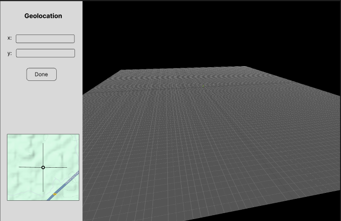
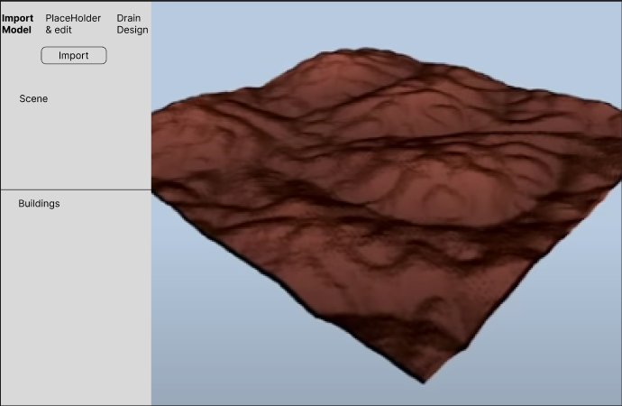
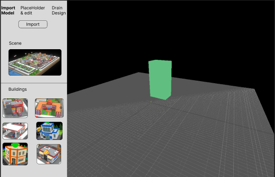
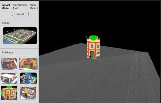
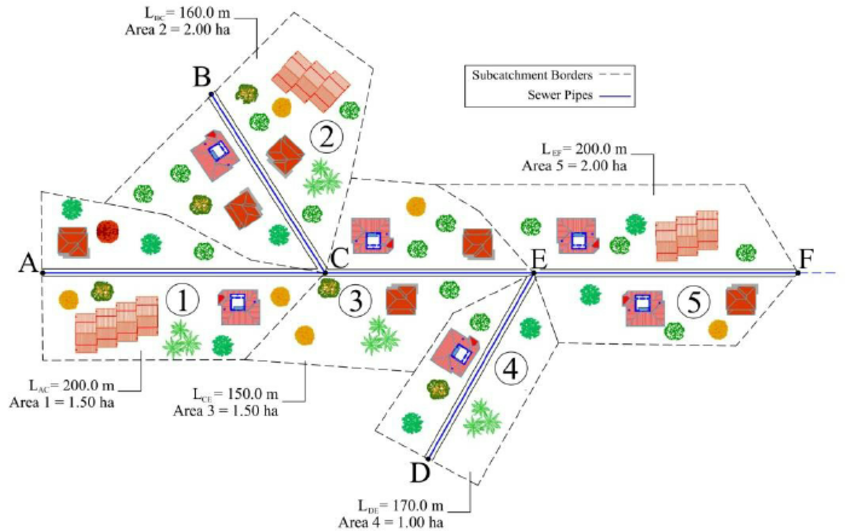
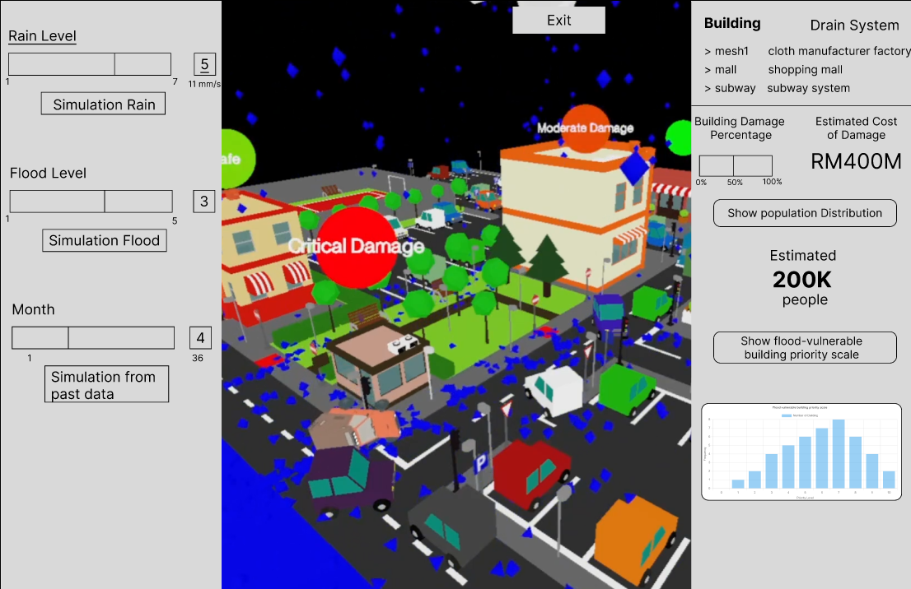
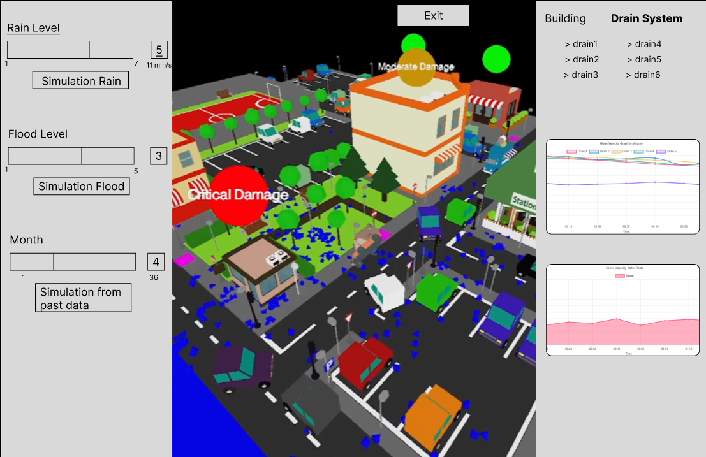
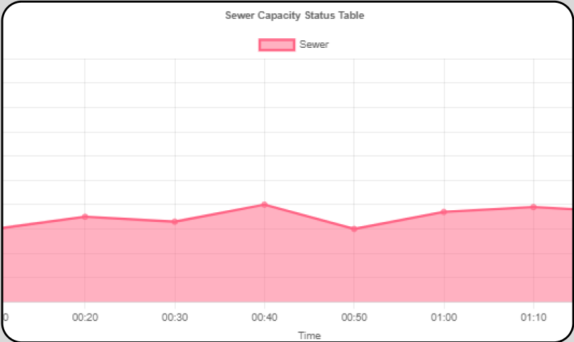
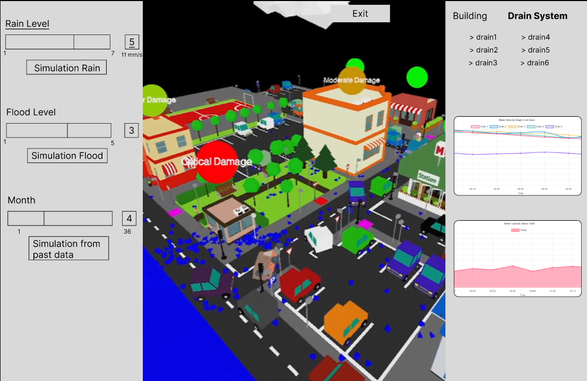
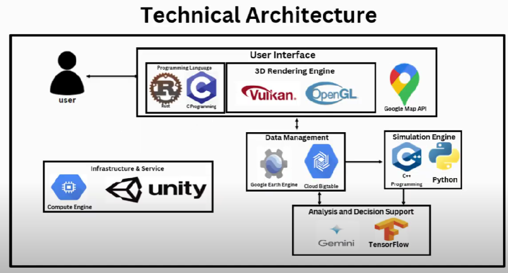

# Team WhyFlood
This is a submission github repositories to Google Solution Challenges

### Youtube Demo Link
[https://youtu.be/WnAyVm_-w2A](https://youtu.be/WnAyVm_-w2A)

### SDG tackle
SDG 9: Industry, Innovation, & Infrastructure
SDG 11: Sustainable Cities
SDG 13: Climate Action

### Google Technologies Used
Google Cloud, Earth Engine, Google Maps Platforms, Machine Learning, Cloud Bigtable

## Project Overview
Floods, one of nature's most devastating forces, unleash chaos on communities worldwide. It contaminates our water sources, spreads diseases, and disrupts the delicate balance of ecosystems. In the last 10 years floods affected 426.84 millions of people, claiming 56000 lives. Its damages also inflict long-lasting economic hardships which cost total of 431.48 billion USD worldwide. From the recent incident in North Chungcheong, South Korea 47 people died from floods and 14400 affected byit.. Even our world-class, New York City also can't avoid flooding on On September 29, 2023, flood came and damaged the city costing around $100 million lost and disrupted subway system and the entire New York City Subway system. 

This project is a flood simulation and management system using digital twins, AI and Computer Aided Design (CAD), creating a digital model that mirrors the city's infrastructure and natural landscapes in real-time. By leveraging AI, the system can predict flood events with high accuracy, allowing for preemptive actions to protect infrastructure, reduce economic losses, and safeguard lives. This significantly improves the city's ability to respond to flood events efficiently and minimizes the impact on the urban environment.

It is name, Spongey, for that it abstractically absorb water from the city, preventing flood and damage

## User Manual

### Start of a new project

As the picture shown, when starting a new project, the user will be prompted to enter the location of the building site. The user can enter the location by entering the latitude and longitude of the location or by clicking on the map.

#Google Maps Platform

### Building digital twin model

So after the user has entered the location of the building site, the flat working site scene will be render with the terrain landscape of the location, mimicking the landscape of the location, particularly the unbalanced height. #Google Earth Engine  

The Urban Planner will then be able to import either their prepare 3D model of the cities built from other 3D modelling software, and when import to the scene, it can simulate to them whether the cities scene is suitable for the location or not. As a not suitable cities 3D model and location, will cause much overlap of the landscape to the cities scene model.

Alternatively, they can build the cities scene one by one

As seen in the picture above, Spongey provide the urban planner with option of placing placeholder shape that may represent the building overall dimension, this help in quick building of the cities scene into a digital twin. Beside just box for building, there can traingular prism, circle decoration or cities, flat rectangular road, and many more.

After placing of their placeholder shape, the user can import 3D model of the building to replace the placeholder shape, and the user can also import the texture of the building to the 3D model, to make it look more realistic. And user can appoint each of this building to be in what type of business, such as manufacturing, subway system, shopping mall, residential house, just to name a few, this allow Spongey smart AI to understand the building and the cities scene better, which can automatically appoint each of these building to a level scale of priority in term of flood-vulnerable from 1 - 10, for instance a subway system will have a flood-vulnerable building prioirity scale of 10; Spongey then can provide better suggestion to the user.

The overall will look like this example, where the user has built the cities scene with the 3D model of the building and the texture of the building.

#### Acknolwedgement of complement software
The 3D model of the building or cities are not created by Spongey, but rather imported from other 3D modelling software, such as Blender, SketchUp, AutoCAD, and many more.

### Drainage System Design

So onto the building of the drainage system, starting from the right panel, user can assess the current estimate cost of the drainage system, maximum outflow rate of this drainage system (meaning the amount of water that are flowing out of the drainage system into the outer environment, such as river, or sea). The user can also assess the maximum inflow rate of the drainage system (meaning the amount of water that are flowing into the drainage system from the city environment, mostly from the sewer inlet). Not only that, the data of volumn of water that can be stored in the drainage system can also be assessed.

Onto the left panel, the user can place the drainage system into the cities scene, and the user can also place the sewer inlet into the cities scene. The user can also place the river or sea into the cities scene, and the user can also place the rain into the cities scene. In this process, the trained city drainage system expert AI by Spongey, will provide suggestion to the user with the best location to place the drainage system, sewer inlet, river or sea, and type of drainage components, to ensure the drainage system is working at its best. The user interface of this should be user-friendly, such of the drag and drop of the 3D drianage model into the cities scene, and Spongey app will automatically understand how the drainage system will combine, such as the outlet of the pipe tot he inlet of the sewer drain.

The import button allow user to import 3D model of the drainage system and sewer inlet from complementing software, that is specifically for designing the shape, material, size, of the drainage system and sewer inlet. One example such as this article technology, [https://trenchlesstechnology.com/now-showing-in-3d-the-sewer-systems-under-our-feet/](https://trenchlesstechnology.com/now-showing-in-3d-the-sewer-systems-under-our-feet/)

At the left panel, there is also one feature of "Generate detail layout plan", which is something for the real urban planner to use, where Spongey will generate the detail layout plan of the drainage system, sewer inlet, and river or sea, and the user can print this layout plan to be used in the real world.

Example of this detail layout plan will look like as follows:

.jpg)

### Simulation of Flood and Rain

During the simulation, focus on the left panel first, the user can simulate the flood and rain, and also third option simulate from past data, this is with the help of Google Earth Engine, Spongey will collect the past weather data of the location specifically, the past data of the location in term of the rain history, and flood history. So with the simulation of rain, there can be a scale from 1 to 7, to simulate the different level of rain, and the user can also simulate the flood, with the scale from 1 to 5, to simulate the different level of flood. The user can also simulate from the past data, for an extend of month range from 1 to 36 months, which with the help of machine learning, will try to simulate in the upcoming n-th months of this city developed, what type of rain and flood will this city face, and how well does this city handle the rain and flood.

#### Building Assessment
Going to the right panel, user can assess the overall building damage real-time with the simulation ongoing, and AI of Spongey can estimate the cost of damage based on the building type, and also the damage it receive. Also because of the AI knowing the building type, Spongey can show the population distribution in the form of a red scale mask on top of the city model, which estimate where most of the people in the city will be located at, and the user can also assess the population damage real-time with the simulation ongoing, and AI of Spongey can estimate the cost of damage based on the population distribution, and also the damage it receive.

As the picture above shown, individual building can also be selected for isolating assess, and their building damage receive can be abstractically show as a 3D board on top of the building.

#### Drainage System Assessment

Going to the right panel, user can assess the overall drainage system performance such as monitoring the water intake of each the drain inlet 

And the water level in the drain sewer as the simulation ongoing, supplying real-time data to Spongey dashboard.

Then based on all the performance analyse, the Spongey drainage system expert AI will come into play again, suggesting for enhancement to the current city drainage system, enhancement can be of followoing:
- Increase the size of the drainage system
- Increase the size of the sewer inlet
- New inlet of the sewer drain
- New outlet of the sewer drain
- Adjusting the location of the drainage system
- Adjusting the location of the sewer inlet
- Angle of inlet pipe
- and many more

The example of suggesting new inlet from the AI after assessing perhaps, the flash-flood is reaching and damaging the high flood-vulnerable priority building (like subway station).

### Conclusion
In conclusion, Spongey is a Computed Aided Design (CAD) tools to help in making a digital twin model of the city, with the help of AI, it can simulate the flood and rain, and also the past data of the location in term of the rain history, and flood history. It can also assess the building damage and population damage real-time with the simulation ongoing, and AI of Spongey can estimate the cost of damage based on the building type, and also the damage it receive. It can also assess the overall drainage system performance such as monitoring the water intake of each the drain inlet, and the water level in the drain sewer as the simulation ongoing, supplying real-time data to Spongey dashboard. Then based on all the performance analyse, the Spongey drainage system expert AI will come into play again, suggesting for enhancement to the current city drainage system, enhancement can be of followoing:

## Technical Architecture

Our digital twin CAD system is a sophisticated ensemble designed to revolutionize urban planning and disaster mitigation through advanced flood simulation and management. At its interface, the system employs a frontend that blends the robustness of Rust and C programming languages, ensuring operational efficiency and reliability. This interface is enhanced by Vulkan and OpenGL, which provide high-performance graphics rendering capabilities, crucial for the detailed 3D visualization of urban environments. The integration of the Google Map API is pivotal, offering users accurate geographical data for precise simulation setups and analyses, thereby grounding the flood simulations in real-world contexts.

The system's prowess in data handling is anchored by Cloud Bigtable, a key-value database known for its scalability and performance. This component adeptly manages the extensive datasets generated during simulations, including critical spatial data and nuanced simulation outcomes, ensuring data is processed and retrieved with remarkable efficiency. The backend, a synergy of Python's versatility and C++'s performance efficiency, hosts the computational engine. Python is instrumental in data analysis and the seamless integration of machine learning models, while its application in calculating the physics of water fluid dynamics is indispensable for realistic simulations. C++, paired with OpenFOAM, brings to life the intricate hydrological and hydraulic modeling, laying the foundation for precise fluid dynamics simulations that are central to the system's flood simulation capabilities.

TensorFlow, a cornerstone of the system's analytical framework, powers sophisticated machine learning models that assess infrastructure damage, estimate repair costs, and refine flood management strategies. This integration of TensorFlow enables the system to transform complex simulation data into actionable insights, facilitating informed decision-making for urban planning and disaster mitigation. Gemini AI complements this by synthesizing assessments from TensorFlow and other data sources to produce actionable recommendations, ensuring that the system's outputs are both relevant and up-to-date.

The entire system is hosted on a robust cloud infrastructure, with services like Compute Engine providing the necessary computational power for processing large datasets and executing complex simulations. This cloud-based approach not only ensures scalability and reliability but also obviates the need for extensive local hardware, making the system accessible and efficient.

In essence, our digital twin CAD system is a harmonious integration of cutting-edge technologies and programming languages, designed to deliver an immersive user experience, precise flood simulations, and invaluable insights for effective flood management and urban planning. It stands as a testament to the potential of modern technology to address some of the most pressing challenges in urban development and environmental resilience.